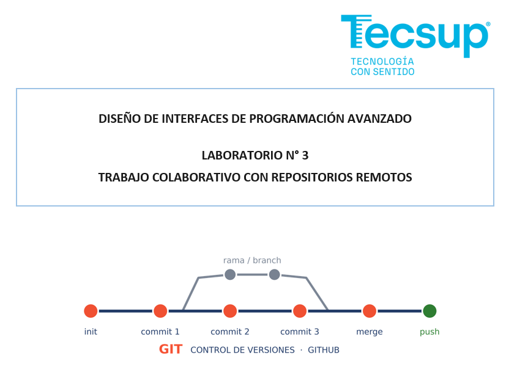

# Guía de Contribución y Despliegue - Tienda TECSUP

Manual técnico desarrollado para guiar a nuevos desarrolladores en la resolución de bugs dentro del sistema de carrito de compras.

## Configuración Inicial del Entorno

### Requisitos Previos

- Contar con una cuenta activa en [GitHub](https://github.com).
- Disponer de Git instalado localmente (comprobar mediante el comando `git --version`).
- Editor de código Visual Studio Code instalado en el sistema.

### Pasos para la Preparación del Espacio Local

1. Realizar un **Fork** del repositorio original de la organización en la interfaz web de GitHub.
2. Copiar la dirección HTTPS de tu fork personal para clonarlo en la computadora.
3. Ejecutar el comando de clonación en tu terminal de trabajo local:
   ```bash
   git clone https://github.comjim-prueba/tienda-tecsup.git
   ```
4. Acceder al directorio raíz del proyecto mediante el comando `cd tienda-tecsup`.

## Ciclo de Vida del Desarrollo y Control de Pendientes

### Lista de Tareas y Verificación del Proyecto

- [x] Reportar errores críticos mediante la creación de un nuevo **Issue**.
- [x] Corregir el bug del cálculo matemático en la función `calcularTotal`.
- [ ] Implementar pruebas unitarias automatizadas para los componentes JavaScript.

## Estructura del Software y Comandos de Auditoría

### Tabla Informativa de Archivos Clave

| Componente / Recurso | Tipo de Archivo | Responsabilidad Principal en la Aplicación                                 |
| :------------------- | :-------------- | :------------------------------------------------------------------------- |
| `index.html`         | Estructura HTML | Renderiza la interfaz del carrito y vincula las hojas de estilos externas. |
| `estilos.css`        | Hoja de Estilos | Controla la presentación visual, tipografías y paleta cromática del sitio. |
| `script.js`          | Lógica JS       | Procesa matemáticamente la lista de objetos y actualiza los nodos del DOM. |

## Corrección Técnica de Bugs Críticos

Para inspeccionar el flujo de trabajo histórico del proyecto se debe utilizar el comando en línea `git log --oneline`.

El siguiente bloque de código en lenguaje JavaScript representa la solución final integrada en la rama `fix-total-carrito` para multiplicar el precio unitario por el volumen comprado:

```javascript
function calcularTotal(lista) {
  let total = 0;
  for (const producto of lista) {
    // Solución al problema de cálculo multiplicando por la cantidad
    total = total + producto.precio * producto.cantidad;
  }
  return total;
}
```

### Evidencia del Sistema Corregido


